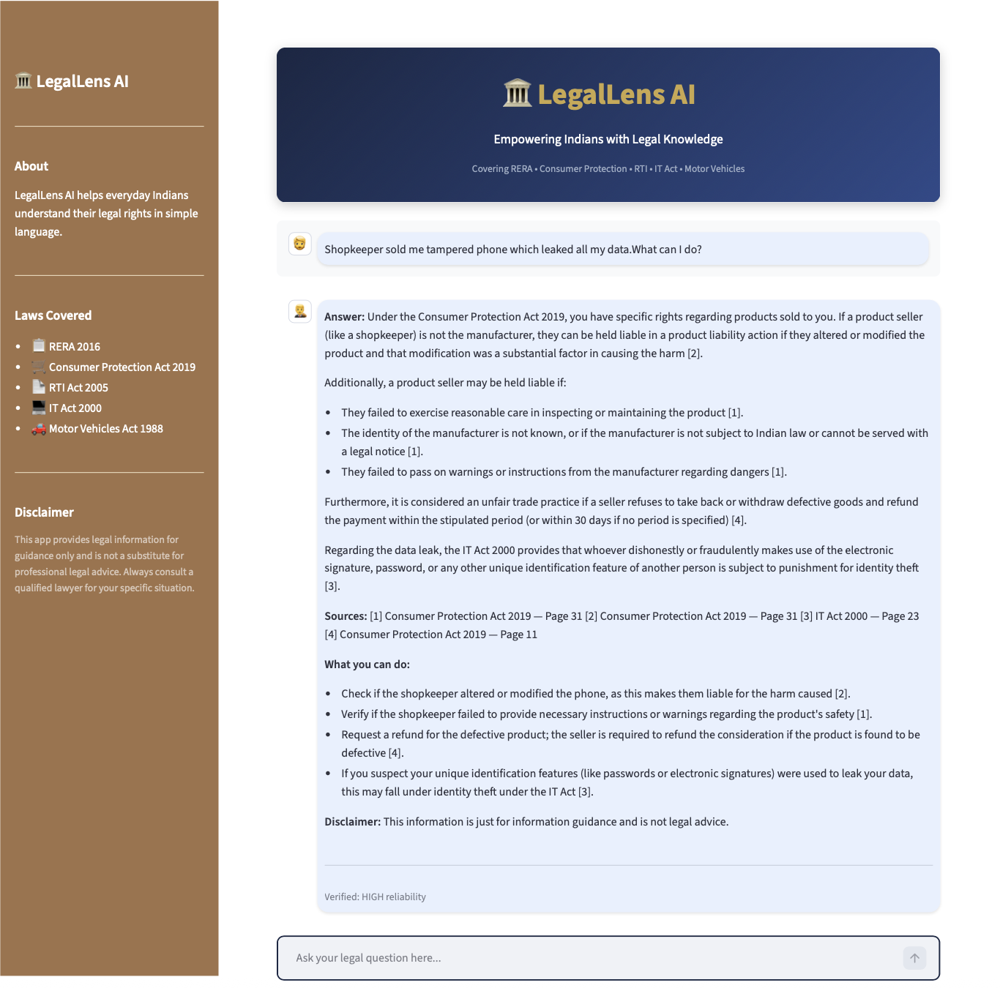

# 🏛️ LegalLens AI. -V1
### RAG-Powered Indian Legal Assistant

> *Empowering everyday Indians with legal knowledge — in plain language, with cited sources.*


---

## 📖 About

Most Indians don't have access to a lawyer for everyday legal questions — whether it's a builder delaying possession, an online fraud, or filing an RTI. **LegalLens AI** bridges that gap.

Built on a **RAG (Retrieval-Augmented Generation)** pipeline, LegalLens AI retrieves relevant sections directly from official Indian law PDFs and grounds every answer in the actual legal text — no hallucinations, no guessing. Every response includes source citations showing exactly which section and which act the answer came from.

**Supports English, Hindi, and Hinglish queries** — automatically responds in the language of the query.

---

## 🎥 Demo

### LIVE DEMO 🌐
[](https://huggingface.co/spaces/YOUR_USERNAME/LegalLensAI)


> 📸 *Screenshots*

Chat Interface and Answers with Citations



---

## ✨ Features

- **RAG Pipeline** — Retrieves relevant legal chunks before generating any answer
- **Query Classification** — Intelligently routes STANDALONE vs FOLLOWUP queries
- **Source Citations** — Every answer cites exact law and page number
- **Answer Verification** — LLM-as-judge checks if answer is grounded in retrieved chunks (HIGH/MEDIUM/LOW)
- **Actionable Steps** — Tells users what they can actually do, not just what the law says
- **Hinglish Support** — Works with Hindi, English, and mixed queries
- **Chat History** — Maintains conversation context across follow-up questions
- **Graceful Fallback** — Says "I couldn't find this" instead of hallucinating
- **Retry Logic** — Handles API rate limits automatically

---

## 📚 Laws Covered (V1)

| # | Law | Year | Coverage |
|---|---|---|---|
| 1 | Real Estate (Regulation & Development) Act | 2016 | Builder disputes, possession delays, refunds |
| 2 | Consumer Protection Act | 2019 | Product defects, service complaints, online fraud |
| 3 | Right to Information Act | 2005 | Filing RTI, exemptions, timelines |
| 4 | Information Technology Act | 2000 | Cybercrime, identity theft, data privacy |
| 5 | Motor Vehicles Act | 1988 (amended 2019) | Accidents, insurance, driving licence |

> **Note:** All laws sourced from official government PDFs (indiacode.nic.in, legislative.gov.in). Minor amendments post-2021 may not be reflected. Always verify with a qualified lawyer.

---

## 🏗️ Architecture

```
User Query
    ↓
classify_query() — STANDALONE or FOLLOWUP?
    ↓                           ↓
STANDALONE                   FOLLOWUP
    ↓                           ↓
retrieve_chunks()         handle_followup()
(ChromaDB search)         (chat history only)
    ↓                           ↓
building_context_prompt()       ↓
    ↓                           ↓
call_with_retry()               ↓
(Gemini 2.5 Flash)              ↓
    ↓                           ↓
verify_answer()                 ↓
(LLM-as-judge)                  ↓
    ↓←←←←←←←←←←←←←←←←←←←←←←←↓
Return {answer, confidence}
    ↓
app.py displays result
```

---

## 🛠️ Tech Stack

| Component | Technology |
|---|---|
| LLM | Gemini 2.5 Flash (`google-genai`) |
| Embeddings | `all-mpnet-base-v2` (sentence-transformers) |
| Vector Database | ChromaDB (persistent) |
| RAG Framework | LangChain |
| PDF Processing | PyMuPDF |
| UI | Streamlit |
| Deployment | HuggingFace Spaces |

---

## 🚀 Installation & Setup

### Prerequisites
- Python 3.12+
- Gemini API key (free at [aistudio.google.com](https://aistudio.google.com))

### 1. Clone the repository
```bash
git clone https://github.com/rishidakshbansal2004-create/LegalLensAI.git
cd LegalLensAI
```

### 2. Create virtual environment
```bash
python -m venv venv
source venv/bin/activate        # Mac/Linux
venv\Scripts\activate           # Windows
```

### 3. Install dependencies
```bash
pip install -r requirements.txt
```

### 4. Set up environment variables
Create a `.env` file in the root directory:
```
GEMINI_API_KEY=your_gemini_api_key_here
```

### 5. Download legal documents
Download the following official PDFs and place them in the `documents/` folder:

| File | Source |
|---|---|
| `rera_2016.pdf` | [indiacode.nic.in](https://indiacode.nic.in/bitstream/123456789/2214/1/A2016-16.pdf) |
| `consumer_protection_act_2019.pdf` | [indiacode.nic.in](https://indiacode.nic.in) |
| `rti_act_2005.pdf` | [indiacode.nic.in](https://indiacode.nic.in/bitstream/123456789/1975/3/right_to_information_act.pdf) |
| `it_act_2000.pdf` | [indiacode.nic.in](https://indiacode.nic.in/bitstream/123456789/13116/1/it_act_2000_updated.pdf) |
| `motor_vehicles_act_1988.pdf` | [indiacode.nic.in](https://indiacode.nic.in/bitstream/123456789/1798/1/A1988-59.pdf) |

### 6. Build the vector database
```bash
python ingest.py
```
This runs once and builds ChromaDB with 1,437 chunks from all 5 acts. Takes 2-3 minutes on first run (downloads embedding model).

### 7. Run the app
```bash
streamlit run app.py
```

Open [http://localhost:8501](http://localhost:8501) in your browser.

---

## 📁 Project Structure

```
LegalLensAI/
├── app.py              ← Streamlit UI
├── rag.py              ← Core RAG pipeline (8 functions)
├── ingest.py           ← Document processing (run once)
├── prompts.py          ← All LLM prompts
├── config.py           ← Tunable parameters
├── documents/          ← Raw PDFs (gitignored)
├── legal_db/           ← ChromaDB vector store (pre-built)
├── .env                ← API key (gitignored)
├── requirements.txt
└── README.md
```

---

## ⚙️ Configuration

All tunable parameters in `config.py`:

```python
GEMINI_MODEL = "gemini-2.5-flash"
EMBEDDING_MODEL = "all-mpnet-base-v2"
CHUNK_SIZE = 800        # characters per chunk
CHUNK_OVERLAP = 100     # overlap between chunks
TOP_K = 4               # chunks retrieved per query
CHROMA_PATH = "./legal_db"
DOCUMENTS_PATH = "./documents"
```

---

## 🗺️ Roadmap

### V1 (Current) ✅
- RAG pipeline with 5 Indian acts
- Query classification (STANDALONE/FOLLOWUP)
- Answer verification agent
- Hinglish support
- Professional Streamlit UI

### V2 (Planned)
- Hybrid search (BM25 + vector via EnsembleRetriever)
- LangSmith observability
- BNS 2023 (replaces IPC) added

### V3 (Future)
- Metadata filtering — search within specific act
- Response streaming
- Better Hinglish — translation step before embedding
- More acts added

### V4 (Research)
- Graph RAG with Neo4j
- PDF upload for custom contracts
- Fine-tuned embedding model on Indian legal text

---

## ⚠️ Disclaimer

LegalLens AI provides legal **information** for guidance only. It is **not** a substitute for professional legal advice. Always consult a qualified lawyer for your specific situation. The app is based on laws as available at the time of building — minor amendments may not be reflected.

---

## 👨‍💻 Author

**Rishi Bansal**
---

## 📄 License

MIT License — feel free to use, modify, and distribute.
